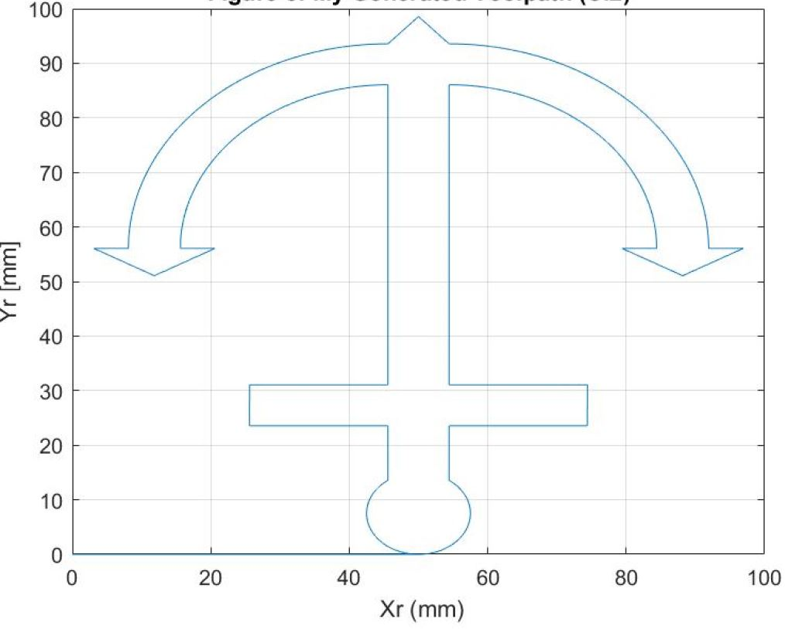

# Digital-Control-2-Axis-CNC-Machine

Figure 1: Generated Toolpath

Figure 2: Pole Placement controller simulation

## Description
* The objective of this project is to design a 2 axis machine controller. 
The goal of the project is to generate trajectories for different toolpaths and 
understand how different controllers affect toolpath response and accuracy, 
how federate affects toolpath accuracy and how the experimental and simulated 
results differ.

## Usage
1. Open Project_3_Lab.m
2. Run the code.

## Author
* Jonas Chianu